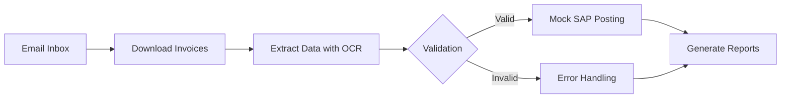

# 📊 Invoice Automation System

  


An end-to-end invoice processing solution designed for RPA learning purposes. This solution demonstrates professional automation techniques using UiPath Studio, including data validation, document processing, and system integration simulations.



## 📂 Project Structure

```text
INVOICE-AUTOMATION/
├── Data/
│   ├── WorkQueue.xlsx
│   ├── validated_invoices.xlsx
│   └── FinalReport.xlsx
├── invoices/
│   └── (Folder for PDF invoice files)
├── logs/
│   └── (Daily log files)
├── screenshots/
│   └── (Error screenshots)
├── scripts/
│   └── validate_po.vbs
├── utils/
│   └── (Python scripts for PDF preparation)
├── workflows/
│   ├── getEmailAttachments.xaml
│   ├── extractInvoiceData.xaml
│   ├── validateInvoiceData.xaml
│   └── mockInputData.xaml
├── .gitignore
├── project.json
├── Main.xaml
└── README.md
```

## 🛠 Key Features

- **Automated Email Processing**: Monitors inbox and downloads attachments
- **Intelligent Data Extraction**: Parses PDF/Excel using UiPath Document Understanding
- **Advanced Validation**: Enforces business rules via VBScript Regex
- **SAP Transaction Simulation**: Mock posting with document generation
- **Comprehensive Monitoring**: Detailed logging and error tracking

## 🚀 Prerequisites & Setup

### Core Dependencies
```text
UiPath.Excel.Activities
UiPath.System.Activities
UiPath.DocumentUnderstanding.ML.Activities
UiPath.IntelligentOCR.Activities
UiPath.OmniPage.Activities
UiPath.VBScript.Activities
```

### Execution Instructions
```powershell
# 1. Clone repository to local machine
git clone https://github.com/callmeAngga/invoice-automation.git
cd invoice-automation

# 2. Place PDF invoices in /invoices folder

# 3. Open project in UiPath Studio and run:
# Main Workflow: Main.xaml
```